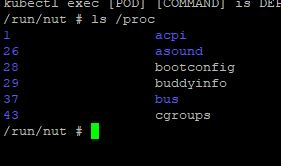
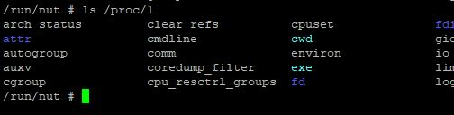
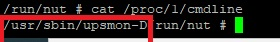
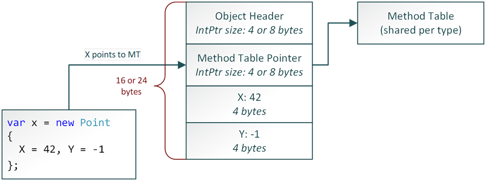

# Über mich

- https://biehler-josef.de
- https://github.com/gabbersepp
- Seit 2011 bei Samhammer AG als Fullstack Entwickler
- Ticketmanagementsoftware FirstAnswer HD

---

# Agenda
- Vorstellung Testprojekt
- Linux: Informationen über Prozesse
- Symbols
- Dotnet CLI Tools
- Tracing mit .NET Event Pipes
- Beispiele

<!-- 

Die Agenda ist mehr als lose Sammlung von Themen zu betrachten 

-->

---

# Wichtig

- Es gibt weit mehr, was man machen kann.
- Allerdings ist vieles davon bei uns zumindest nicht machbar
- Apps im Cluster und kein Rootzugriff
- deswegen beschränke ich mich auf das, was wir tun

<!-- Man kann auch Kernelaufrufe tracen, aber nicht ohne erweiterte Rechte -->

---

# Testprojekt
- Demo

<!--
- wir werden nicht alles im Tool nutzen
-->

---

# Linux - Informationen über Prozesse

- `/proc` Dateisystem
- virtuell
- enthält Informationen zu Prozessen
- `top`, `ps` und andere nutzen auch nur dieses Dateisystem

---

# Linux - Informationen über Prozesse





---

# Symbols
- Verknüpfen Speicheradressen mit Quellcode (nativ)
- oder IL Offsets mit Quellcode
- notwendig, um Callstacks lesbar zu machen
- **Private Symbols**: mit Zeilennummern
- **Public Symbols**: keine Zeilennummern
- **_NT_SYMBOL_PATH**
- Sourcelink aktivieren
- auch ohne Symbols ist ASM Code verfügbar

---

# Symbols - Lokal im Container
- Debuggen im ASM Code nicht möglich mit Remotedebugger
- Aber: Debuggen im C# Code der Libs
- Laden der Symbols im Container
- Demo

<!--
- Man kann Frameworkcode debuggen
- Demo: App starten, pausieren
- in Aufrufliste in Framework Frame klicken
- => Kein Code da
- Modulliste -> Pfad kopieren -> dotnet-symbol
- Rechtsklick -> Quellcode
-->

---

# CLI Tools

- Cross Platform
- Einmal gelernt, immer anwendbar
- Install möglich, wenn SDK als Basisimage genutzt wird
- ansonsten oftmals auch Download möglich
- dotnet-dump
- dotnet-gcdump
- dotnet-trace
- dotnet-counters
- dotnet-monitor
- dotnet-stack
- dotnet-sos

---

# Diagnose im Container

- dotnet Tools funktionieren auch im Container
- können auch in Sidecar Container laufen
- `dotnet-monitor` ist extra für die Anwendung im Sidecar Container gedacht

---

# dotnet-sos

- Erweiterung für native Debugger
- Umgang mit managed Code in nativen Debuggern
- aktuelle WinDbg Versionen brauchen das nicht mehr
- für Linux (LLDB) jedoch erforderlich
- LLDB jedoch durch dotnet-dump kaum mehr notwendig

---

# dotnet-symbol

- aktuelle Versionen von WinDbg und LLDB mit dotnet-sos laden MS Symbole selber herunter
- manchmal geht das aber nicht
- dotnet-symbol ist die Lösung

---

# Perfview
- betrachten von Traces und GCDumps

---

# dotnet-dump

- Dump erstellen
- `dotnet-dump collect -n/-p [--type]`
- Type = Heap, Full (`default`), Mini (`Modules, Threadlist, Exceptioninfos, Stacks`)
- Auch Analyse von Dump möglich!
- `dotnet-dump analyze`

---

# dotnet-gcdump

- Enthält Objektbaum
- Wer referenziert Was
- keine "Inhalte"
- oftmals schneller, je nach Anwendungsfall
- Diff auch möglich
- Demo: `gcdump` vs. `dump`

---

# dotnet-trace

- Sammelt .NET Traces (EventPipes)
- Bietet vordefinierte Profile
- Man kann auch eigene Provider angeben
- Sehen wir später noch im Detail

---

# dotnet-counters

- Sammelt Counters (EventPipes)
- z.B. Anzahl Exceptions, GC Events, etc
- Sehen wir später noch im Detail

---

# Tracing

- Framework und Libraries können Events senden
- eigene Apps können ebenfalls Events implementieren
- Viele vorgefertigte Eventprovider
- z.B. CPU Sampling, GC Events, HTTP Events
- auch Counters: Anzahl Exceptions, Anzahl Garbage Collections
- eigene: z.b. durchschnittliche Dauer pro Datensatz bei Import
- oder: Gesendete Nachrichten über Websocket

---

# Tracing - Vorteile

- Events können feingranular gefiltert werden
- Loglevel existiert ebenfalls
- leichtgewichtig und aufs äußerste optimiert

<!--
Vergleich zu Logfile
-->

---

# Tracing - Nachteile

- Tracing über EventPipes läuft im Usermode
- Dadurch keine besonderen Rechte notwendig
- Aber: Performance schlechter als über kernelmode Tracing (ETW)
- Bsp: CPU Sampling friert periodisch alle Managed Threads ein
- Aber: m.E. keine Alternative vorhanden für Clusterbetrieb

---

# Tracing - Log Level

```
typedef enum
{
    COR_PRF_EVENTPIPE_LOGALWAYS = 0,
    COR_PRF_EVENTPIPE_CRITICAL = 1,
    COR_PRF_EVENTPIPE_ERROR = 2,
    COR_PRF_EVENTPIPE_WARNING = 3,
    COR_PRF_EVENTPIPE_INFORMATIONAL = 4,
    COR_PRF_EVENTPIPE_VERBOSE = 5
} COR_PRF_EVENTPIPE_LEVEL;
```

---

# Tracing - Events sammeln

- Beispiel: `Microsoft-Windows-DotNETRuntime` Provider
- Szenario: `Exceptions werfen`
- https://learn.microsoft.com/en-us/dotnet/fundamentals/diagnostics/runtime-events
- Keyword: 0x8000 (Exceptions)
- Level: 4 (Info)
- `dotnet-trace collect --providers "Microsoft-Windows-DotNETRuntime:0x8000:4" -p <pid>` (Info Level)
- vs: `dotnet-trace collect --providers "Microsoft-Windows-DotNETRuntime:0x8000:2" -p <pid>` (Error Level)
- man sieht: Fein granulare Filterung möglich

<!--
Link:https://learn.microsoft.com/en-us/dotnet/fundamentals/diagnostics/runtime-events
drauf gehen um verschiedene Events zu sehen

Rechtsklick sauf Eventzeit, AnyStacks
Callees Tab um Stacktrace zu sehen
-->

---

# Tracing - Eigene Events erzeugen (und sammeln)

- Szenario: `Eigene Events erzeugen`
- Nur **Int** Logs: `dotnet-trace collect --providers "Workshop.Random:0x1:4" -p`
- Sowohl **Int** als auch **Double**: `dotnet-trace collect --providers "Workshop.Random:3:4" -p`

<!--
Der Code dient nur als Beispiel.
Man sollte da nochmal schauen, wie man es richtig macht
-->
---

# EventCounters

- Realtime Metriken
- 4 Arten: **EventCounter**, **PollingCounter**, **IncrementingEventCounter**, **IncrementingPollingCounter**
- Beispiel: `dotnet-counters monitor -p <pid>`

<!--
monitor und collect
-->
---

# EventCounters - EventCounter

- Bei jeder relevanten Aktion wird ein numerischer Wert aufsummiert
- Daraus lassen sich berechnen: Min, Max, Avg, ....
- Beispiel: Dauer eines Requests -> Avg Requestdauer

<!--
oder: Durchschnittliche Dauer Schritt eines Imports
-->

---

# EventCounters - IncrementingEventCounter

- im Prinzip ein EventCounter bezogen auf eine Zeiteinheit
- Beispiel: Anzahl Requests pro Sekunde

---

# EventCounters - PollingCounter

- Eventcounter ruft Wert periodisch selber ab mittels Callback
- Beispiel: Gesamtverbrauch Arbeitsspeicher

---

# EventCounters - IncrementingPollingCounter

- Ruft Wert X periodisch per Callback ab
- Reportet wird `X_neu - X_alt`
- Ergibt eine Erhöhungsrate bezogen auf eine Zeiteinheit
- Beispiel: Änderung des Arbeitsspeichers pro Sekunde

---

# EventCounters - Einsatzzwecke und Unterschiede

- **(Incrementing)EventCounter**: Wenn man den relevanten Wert selber zum Zeitpunkt der Erzeugung zur Hand hat.
- **(Incrementing)PollingCounter**: Wenn dies nicht möglich ist. 

---

# EventCounters - Selber erzeugen

- Szenario: Event Counters
- `dotnet-counters monitor --providers "Workshop.Counters" -p <pid>`
- `dotnet-trace collect --providers "Workshop.Counters:0:0:EventCounterIntervalSec=5" -p <pid>`

---

# dotnet-trace - Profile

- dotnet-trace kennt vordefinierte Profile
- `dotnet-trace list-profiles`

---

# dotnet-monitor - Demo

- App Container und dotnet-monitor Container müssen `/tmp` Verzeichnis teilen
- Denn: Tracing läuft über Unix Domain Socket (Linux) bzw Named Pipe (Windows)
- `docker volume create dotnet-tmp`
- `docker run -it --rm -p 52323:52323 --mount "source=dotnet-tmp,target=/tmp" -e DOTNETMONITOR_Urls="http://*:52323" mcr.microsoft.com/dotnet/monitor collect --no-auth`
- Volume im Testprojekt:
```
  <PropertyGroup>
    ...
	<DockerfileRunArguments>--mount "source=dotnet-tmp,target=/tmp"</DockerfileRunArguments>
  </PropertyGroup>
```

<!--
https://github.com/dotnet/dotnet-monitor/tree/main/documentation
mal einen beliebigen GET Request ausprobieren
-->

---

# dotnet-monitor - K8S

- Empfehlung: Als Sidecar in K8S 
- Siehe Demoprojekt

<!--
am dev-cor zeigen. mit grep filtern!!
-->

---

# CPU Sampling - Kernel Mode

- Stacktrace-Event wird auf Basis von EIP/RIP Register erstellt
- Nachteil: Damit sieht man keine Sleeps, Waits, etc
- Zudem: Spezielle Rechte erforderlich

---

# CPU Sampling - User Mode

- Microsoft-DotNETCore-SampleProfiler
- im Appprozess wird ein Thread gestartet
- pausiert alle anderen und holt deren Stacktraces ab
- hat theoretisch Auswirkung auf Performance

---

# CPU Sampling - User vs Kernel Mode

- Demo
- Task.Delay tauch nirgends auf (da `Task` und kein blockierter Thread)
- `Sleep` taucht im Kernelmode Sampling nicht auf

<!--
Grouppattern: `coreclr!->;!=>REST`
-->

---

# CPU Sampling - Probleme im Usermode

- `LongRunningWhile` und `Sleep` optisch nicht unterscheidbar
- CPU Auslastung damit nicht analysierbar
- mögliche Lösung: Threads filtern, die viel Zeit in Waits verbraten

---

# Sampling über VS

- möglich, nutze ich nicht
- bei mir sehr langsam

---

# Thread-Time Profiling

- CPU Sampling liefert keine hinreichenden Informationen über Threads, die nicht ausgeführt werden
- Thread-Time Profiling beantwortet: 
  - Wie lange ist Thread "idle"
  - Wieso
- Speichern des IP bei Context Switch oder Statuswechsel von Thread zu `Ready for Running`

---

# Thread Time Profiling Usermode

- nicht-async Code: Requestreihenfolge stimmt
- `Inc`/`Inc Ct` spiegelt nicht die Dauer wieder
- Differenz beider Zeitspalten ergibt Dauer
- Findet man auch in den Events wieder
- Usecase: Rausfinden, welche Abfragen zu anderen Diensten während eines Asp Net Core Requests erzeugt werden

---

# Befehl

dotnet-trace collect -p 287 --profile cpu-sampling --providers "Microsoft-Diagnostics-DiagnosticSource:0xFFFFFFFFFFFFF7FF:4:FilterAndPayloadSpecs=HttpHandlerDiagnosticListener/System.Net.Http.Request@Activity2Start:Request.RequestUri\nHttpHandlerDiagnosticListener/System.Net.Http.Response@Activity2Stop:Response.StatusCode,System.Threading.Tasks.TplEventSource:1FF:5"

---

# Dumpanalyse

- Manchmal auch unverzichtbar
- Linuxdump in Linux öffnen: Architektur und Distro muss dem Quellsystem entsprechen
- aber: Linuxdump kann in Windows mit WinDbg, dotnet-dump, VS, ... geöffnet werden
- Dump kann auch im Live Container analysiert werden

---

# Exkurs Speicherlayout .NET

- Objektreferenz zeigt auf MT Pointer
- Davor: Objektheader



---

# Dump & Monitor.Enter

- Objektheader beinhaltet ID des blockierenden Threads
- oder Hashcode
- wenn beides gebraucht wird: Objektheader enthält Syncblockindex
- [Syncblockindex](https://github.com/DustinCampbell/dotnet-runtime/blob/main/src/coreclr/vm/syncblk.h) verweist auf Syncblock, dieser enthält HashCode
- BIT_SBLK_IS_HASHCODE und BIT_SBLK_IS_HASH_OR_SYNCBLKINDEX Bits

---

# Dumpanalyse - Demo

- Objekt ohne `Hashcode`, ohne `lock`
  - Header = 0
- Objekt mit `Hashcode`, ohne `lock`
  - Header enthält Hashcode und Bits aus vorheriger Folie
- Objekt ohne `Hashcode`, mit `lock`
  - Header enthält Threadnummer
- Objekt mit `HashCode`, mit `lock`
  - Header enthält Syncblockindex

<!--
https://github.com/DustinCampbell/dotnet-runtime/blob/main/src/coreclr/vm/syncblk.h

wichtig: Hashcode von zweitem Schritt aufschreiben

dumpheap -type TestObject
dd <addresse - 8>

dumpheap bei jedem Dump neu machen, es könnte sein, dass DotNet das Objekt verschoben hat

dd <syncblock> -> mittendrin ist dann der hashcode
-->
---

# Anwendungsfälle für das echte Leben

Wir betrachten nun einige Fälle, die so oder ähnlich bei uns schon vorgekommen sind.

---

# Trace - Connect Mode

- App lässt sich kaum starten
- stürzt ab, bevor `dotnet-trace` gestartet werden kann
- **Was tun? Wie kann ich nun eine Analyse starten?**

---

# Lösung: Connect Mode

- Env im Prozess setzen: **DOTNET_DefaultDiagnosticPortSuspend=1**
- DotNet wird nun warten, bis sich ein Analysetool verbindet

<!--
In Program.cs ist der Bug drin
Env Var: TriggerError
-->

---

# Hohe CPU Auslastung

- Hilfe: Grafana zeigt dauerhafte Auslastung eines Kernes an
- System reagiert träge
- Szenario: `Beispiele > Hohe CPU Auslastung`

---

# Hohe CPU Auslastung

- Lösung: Trace mit Standardprofil (CPU Sampling)
- `dotnet-trace collect -p <pid>`

<!--
- AnyStacks
- Exc Spalte m.E. im Usermode Sampling nicht aussagekräftig
- Sortieren nach Inc
- Wir sehen viele Thread Einträge mit 11% / 13.000 Inc Ct
- augenscheinlich alle Threads ausgelastet, aber: User Mode
- schauen in "byName" ohne Group: Welche Threads haben sehr viel Wait o.ä. Die excluden
- nach und nach aufräumen
- ggf auch schauen, welcher Code in byName ist von mir
- die Stellen prüfen
- oder: vorher im System prüfen, welcher Thread ausgelastet ist, z.b. ps
-->

---

# Monitor.Enter - Deadlock

- Szenario: `Beispiele > Deadlocks durch Monitor.Enter` (Zwei Threads mit `lock()` Statement)
- Hilfe: Auf dem Liveserver geht manches nicht mehr
- Bestimmte Requests laufen ewig, HTTP Timeouts an allen Ecken und Enden
- Keine Logeinträge, keine Queries im SQL Profiler (obwohl welche da sein sollten)
- ...

---

**Was tun?**
- Sofort Dump holen (wer weis, wann die Liveness Probes anschlagen!)
- `pstacks` Befehl

---

# Monitor.Enter - Deadlock

Oft reicht `pstacks` schon aus. Meist kennt man den Code und die Stellen, an denen `lock()` oder andere Konstrukte benutzt werden. Fixen sollte dann ein Leichtes sein.
Möchte oder muss man tiefer eintauchen, so kann man auch z.B. den blockierenden Thread ermitteln. Das sehen wir demnächst.

---

# Threadpoolstarvation

- Szenario: `Beispiele > Threadpoolstarvation`
- Hilfe: Ingress Log zeigt stetig steigende Requestzeiten an
- Kunden melden durch die Bank bei unbestimmten Requests Timeouts
- Erster Verdacht: Deadlock?
- aber: `pstacks` zeigt keine typischen Lock Stacktraces
- was nun?

---

# Threadpoolstarvation

- `threadpool` Befehl
- `Workers Total/Running` = identisch -> Workerthreads sind ausgelastet
- es sollten eher ein paar auf idle sein, ansonsten zu wenig Threads für die Tasks
- wie werden Workerthreads gespawnt?
- `threadpoolqueue` listet Anzahl an Tasks auf
- `dotnet-counters` kann auch helfen
- Man sieht: Skaliert langsam
- mögliche schnelle Lösung: `ThreadPool.SetMinThreads(2000, 10);`

---

# Deadlock zwischen dotnet und SQL

- Hilfe: Auf dem Liveserver geht manches nicht mehr
- Bestimmte Requests laufen ewig, HTTP Timeouts an allen Ecken und Enden
- Keine Logeinträge, keine Queries im SQL Profiler (obwohl welche da sein sollten)
- `pstacks` zeigt kein Deadlocktypisches Bild

**Was ist los?**
- Deadlock zwischen dotnet und SQL könnte die Ursache sein
- nicht sofort ersichtlich
- **Demo:** Beispiele / Deadlock zwischen DB und Dotnet

---

# Deadlock zwischen dotnet und SQL

- Ziel: Rausfinden, welcher Thread den `Monitor.Enter` blockiert
- um: Anschließend durch Codeanalyse das Problem zu beheben

<!--
**Bei sparsamer Verwendung** von `lock` kann der blockierende Thread ggf leicht ermittelt werden durch die Analyse der **wenigen** Stellen, welche das `lock` Statement auf das betroffene Objekt aufrufen. Aber das wird leider unpraktisch bei häufigen Verwendungen des gleichen Lockobjektes. Zudem fehlt dadurch die Info, welche Ressource auf DB Ebene für den Deadlock verantwortlich ist (wobei wir zu dem jetzigen Zeitpunkt noch nicht wissen, dass SQL beteiligt ist ;-) )
-->

---

# Ausgangslage

- man weis nicht, dass es ein Deadlock ist
- man weis folglich nicht, dass ein SQL Query eines anderen Threads beteiligt ist
- man weis nur, "da hängt was" am `Monitor.Enter`

# Vorgehen
- Blockierenden Thread ermitteln

---

# Monitor.Enter - Blockierenden Thread ermitteln

- `pstacks` 
- `setthread` zu einem der wartenden
- wichtig: nochmal mit `clrstack` prüfen, ob wir richtig sind
- `dso` um die Objekte auf dem Stack anzuzeigen
- `syncblk` zur Anzeige aller Syncblocks
- `Syncblock Owner` == Adresse des Objekts aus `dso`
- `Owning Thread` = Übeltäter
- Alternative: `syncblk` als Startpunkt, aber bei Systemen mit viel Aktivität bei `Syncblocks` wird man hier nicht den richtigen finden

---

# Owning Thread - Callstack weist SqlClient Frames auf

**Ein erster Blick** in den Callstack des blockierenden Threades lässt übles erahnen: Wir befinden uns in einem Stackframe mit Bezug auf eine SQL Verbindung. Was nun?

**Ziel ist es** nun, rauszufinden, was auf DB Seite gelockt **ist**. Wir sehen (im MS SQL Server) auf jeden Fall die gelockten Ressourcen, aber auch (mit etwas Glück) den auslösenden Query.

**Dazu brauchen wir** die ServerProcessId (spid) der SQL Verbindung des blockierten Prozesses. Wenn wir diese haben, können wir den Rest im Management Studio finden.

---

# SPID des blockierten Threads finden

**Wo die SPID** zu finden ist, habe ich durch Analyse der Objekte in einer Debuggingsession in einer Demoapplikation rausgefunden: `SqlConnection.ServerProcessId`

**Ziel** ist es nun, das richtige SqlConnection Objekt zu finden.

---

# SPID finden - Variante 1

- SqlConnection ist im Stack auffindbar
- `setthread` nutzen, um zum blockierten Thread zu wechseln
- `dso` reicht, um die SqlConnection Objekte aufzulisten
- funktioniert z.B. im Beispiel wunderbar

---

# SPID finden - Variante 2

- `dumpheap -type SqlConnection`
- `dumpheap -mt ......`
- `gcroot ...` für jedes Objekt
- das Objekt, welches dem blockierten Thread zuzuordnen ist, benötigen wir 
- `gcroot` Schritt wäre sehr aufwändig 
- dotnet-dump bietet keine Scriptingmöglichkeit

---

# SPID - dotnet-dump automatisieren

- `dbg.txt` erstellen mit:
  dumpheap -mt 7f11df5f2638
  exit
- `dotnet-dump analyze core_..... < dbg.txt > out.txt`
- Speicheradressen und `gcroot` Befehl in `dgb.txt` kopieren (mit `exit` am Ende)
- `dotnet-dump analyze core_xxxx < dbg.txt > out.txt`
- nun mittels `cat out.txt | grep -B4 10dd`
- `-B4` notwendig wegen Cache Hinweis

---

# SPID

Wenn man SqlConnection hat:

- SqlConnection anklicken -> Code öffnet sich
- nicht hilfreich:  `public int ServerProcessId => throw null;`
- im repo suchen: https://github.com/dotnet/SqlClient/blob/main/src/Microsoft.Data.SqlClient/netcore/src/Microsoft/Data/SqlClient/SqlConnection.cs
- ServerProcessId -> GetOpenTdsConnection().ServerProcessId -> InnerConnection.ServerProcessId -> Parser._physicalStateObj._spid;
- dem Pfad folgen wir im Dump

---

# SPID - Ermitteln der gelockten Ressource

**gehaltene Locks mit Ressource:**
- `select * from sys.dm_tran_locks`
- gelockte Ressource: `DBCC PAGE (46, 1,3144, 3) WITH TABLERESULTS`

---

**Query, welcher zu Lock führte:**

```
DECLARE @tblVariable TABLE(SPID INT, Status VARCHAR(200), [Login] VARCHAR(200), HostName VARCHAR(200), 
    BlkBy VARCHAR(200), DBName VARCHAR(200), Command VARCHAR(200), CPUTime INT, 
    DiskIO INT, LastBatch VARCHAR(200), ProgramName VARCHAR(200), _SPID INT, 
    RequestID INT)

INSERT INTO @tblVariable
EXEC Master.dbo.sp_who2

SELECT v.*, t.TEXT 
FROM @tblVariable v
INNER JOIN sys.sysprocesses sp ON sp.spid = v.SPID
CROSS APPLY sys.dm_exec_sql_text(sp.sql_handle) AS t
ORDER BY BlkBy DESC, CPUTime DESC
```

---

# Quick & Dirty Fix am Live

Wenn das Problem identifiziert ist und der Betrieb im Livesystem wiederhergestellt werden muss, kann, ohne die ganze App neuzustarten, die Verbindung im Management Studio mittels `kill <spid>` abgeschossen werden.
**Achtung:** Da sollte man wissen, was kaputt gehen kann. Aber man muss sich im Klaren sein, dass diese Konstellation nicht "sauber" aufgelöst werden wird! Irgendwann wird sowieso der Commandtimeout greifen und den wartenden Query abschießen. 

---

# Netzwerkprobleme

- hier können wir nur mit Traces arbeiten
- Wireshark etc. geht leider nicht im Cluster
- `network.rsp` enthält alle wichtigen Provider
- `dotnet-trace collect -p <i> @network.rsp` vermeidet Eingabe langer Kommandozeilen

---

# Netzwerkprobleme 

- **Demo** `Einfache Socket Traces`
- AspNetCore: Tracen von Requestparameter und Responsebody
- HttpClient: Hostname nicht auflösbar
- HttpClient: Port nicht erreichbar
- HttpClient: Zertifikat ungültig

**Aktueller Fall bei uns von vor vier Wochen:**
- Request an externe Schnittstelle schlägt fehl
- leere Response
- Logeintrag nicht aussagekräftig
- Optionen: Hotfix deployn mit besseren Logeinträgen (Statuscode z.B.) oder **Tracing**
- Ergebnis: 401, Empty Response

---

# InvalidProgramException in Proxy Objekten

- EF, Mocking Libs, etc.
- Kann bei IL Rewriting passieren oder dynamischer Code Erzeugung per ILGenerator
- **Demo:** Beispiele -> RestrictiveGetter

**Beispielhaftes Vorgehen:**
- Dump holen
- `name2ee *!Proxy_TestClass.get_Field`
- `dumpil 00007f0b5cc524a8`
- IL Code von `get_Field` anschauen
- IL Code verstehen und Fehler finden :)
- hier leicht: Es fehlt Parameter vor Objekterstellung

---

# Speicherproblem

- Hilfe, mein Speicher explodiert
- Was tun?
- Wie ermittle ich meinen Speicherverbrauch?
  z.B. `cat /proc/5181/smaps | grep -i pss |  awk '{Total+=$2} END {print Total/1024/1024" GB"}'`

---

# Speicherprobleme - Mögliche Probleme

**Welche Fälle gibt es?**
- **Speicher steigt an** und ich will wissen, woher das kommt
  **Lösung:** Memory Allocation Trace (Profil: *gc-verbose*)
- **Speicherverbrauch ist bereits hoch** 
  **Lösung:** `gcdump` zeigt, was alles im Speicher liegt, wieviel die Objekte brauchen und wo sie referenziert sind
  **Oder:** `Memorydump` zeigt zusätzlich, welchen Inhalt die Objekte haben und ist per dotnet-dump/WinDbg/lldb analysierbar

---

# Memory Allocation Trace

- `dotnet-trace collect -p xx --profile gc-verbose`

# GCDump

- per `dotnet-gcdump`

# Dump

- per `dotnet-dump`

---

# Viel Speicherverbrauch durch dynamische Klassen

- Szenario: `Speicherleak durch dynamische Klassen`

<!--
vorher und nachher:
cat /proc/1681/smaps | grep -i pss |  awk '{Total+=$2} END {print Total/1024/1024" GB"}'

prüfen mit (vorher-nachher)
eeheap -loader (da dürfte die assembly drin sein)
  high/low frquency heap steigt an

dumpdomain -> zeigt assemblies bzw module an

dotnet-counters -> GC heap sehr klein, working set groß -> unmanaged memory leak

dumpmodule -mt -> zeigt die MethodTables im modul an
dumpmt <mt> zur anzeige von metadaten
dumpclass <eeclass> zeigt klasse an

daraus findet man hoffentlich notwendige infos
-->
---

# Viel Speicherverbrauch durch managed Leak

- Szenario: `managed Speicherleak`

<!--
counters -> heap vs working set
Dump holen
dumpheap -stat
-> 7f8bd485b7d0   657 6,362,077 System.Byte[]

dumpheap -mt 7f8bd485b7d0
->
    7f87bc1d59f0     7f8bd485b7d0             61
    7f87bc1d5ae0     7f8bd485b7d0             61
    7f883bfff5d0     7f8bd485b7d0          1,048
    7f883c008b70     7f8bd485b7d0         65,560
    7f896bfff038     7f8bd485b7d0        158,744
    7f896c025c70     7f8bd485b7d0        158,744
    7f896c04c8a8     7f8bd485b7d0        158,744
    7f896c0734e0     7f8bd485b7d0        158,744
    7f896c09a118     7f8bd485b7d0        158,744
    7f896c0c0d50     7f8bd485b7d0        158,744
    7f896c0e7988     7f8bd485b7d0        158,744
    7f896c10e5c0     7f8bd485b7d0        158,744
    7f896c1351f8     7f8bd485b7d0        158,744
    7f896c15be30     7f8bd485b7d0        158,744


gcroot 7f896c0e7988

-> man sieht nun, dass versehentlich der cache im singleton gefüllt wird und nicht bereinigt wird
-->

---

# Woher kommt der Speicherverbrauch

- Hilfe: Speicher steigt stark an
- Woher kommt der Verbrauch?
- => Memory Allocation Trace
- `dotnet-trace collect --profile gc-verbose -p <pid>`

<!--
Sortieren nach Exc Ct
Type ...
Rechtsklick -> Goto Source
-->

---

Ende :-)